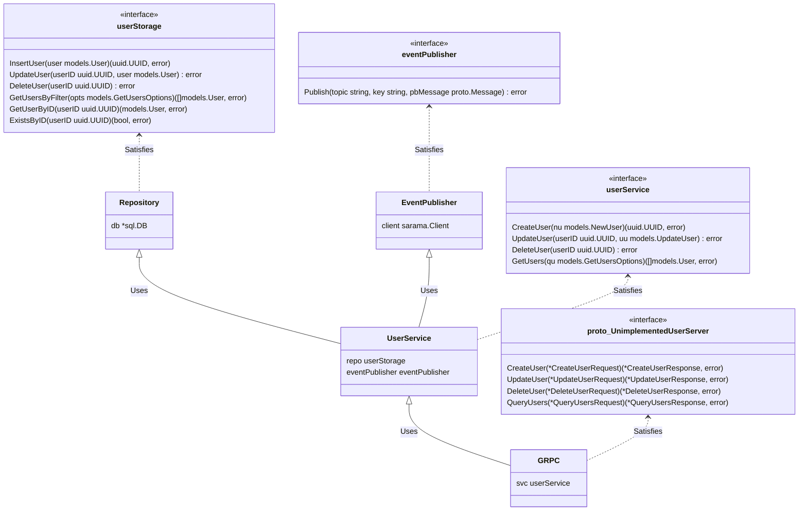

# GRPC User management service 

[](https://github.com/TonyPath/user-mng-grpc-service)


## Infra

### DB/Storage

The service uses PostgreSQL to store its state

### Streaming

The service uses Kafka to produce events for other services

| Kafka Topic              | Message Type |
|--------------------------| ------------- |
| UserCreated   | UserCreated |
| UserUpdated        | UserUpdated |

## Project structure

### `/proto-schemas`
Message and RPC definitions.
To generate the go specific source code type:
```shell
make gen-proto
```
### `/proto`
Output directory of gRPC and messages specific go source code.
### `/infra`
Contains files to dockerize the application
### `/transport/grpc`
GRPC Server that serves the user management API 
### `/transport/http`
HTTP Infra server exposes health check endpoints(readiness, liveness)  
### `/stream`
Kafka producer
### `/internal`
Core application logic (config, services, repositories, models)
### `/dockertest`
Utilities to used for integration tests with the help of docker api

## Class Diagram



## How to start, use and stop
***
To start the service type
```shell
make serve
```

***

To view logs of the service type
```shell
make logs
```

***
Usage examples:


<details>
<summary>Create user</summary>

```shell
$ grpcurl -d '{"email":"user1@mail.com","first_name":"user1_name","last_name":"user1_lname","nickname":"user1_nkname","password":"secret","country":"GR"}' -plaintext localhost:50000 services.user.User/CreateUser
{
  "userId": "166f7137-8884-42ab-90b2-1c2d77fc1037"
}
```
</details>

<details>
<summary>Listing  all users (default page size = 10)</summary>

```shell
$ grpcurl -d '{}' -plaintext localhost:50000 services.user.User/QueryUsers
{
  "users": [
    {
      "id": "166f7137-8884-42ab-90b2-1c2d77fc1037",
      "email": "user1@mail.com",
      "firstName": "user1_name",
      "lastName": "user1_lname",
      "nickname": "user1_nkname",
      "country": "GR",
      "password": "$2a$10$LpgLzRcXkxU45Wwqgd.d9evdJ0wAV63LCFeLm.J78k2d1FBbnPNXG",
      "createdAt": "2022-08-16T22:54:06.419671Z"
    },
    {
      "id": "b3ce8fed-d5e8-4583-8783-b95969b5bc0c",
      "email": "user2@mail.com",
      "firstName": "user2_name",
      "lastName": "user2_lname",
      "nickname": "user2_nkname",
      "country": "GR",
      "password": "$2a$10$wNV.oRXIaAjPCbZp01zrf.KBwCq98AZZ1lEAEq/0VMEaEMlUSHiN6",
      "createdAt": "2022-08-16T22:54:34.134916Z"
    },
    {
      "id": "5631dc46-54a4-4f00-a296-faa248a98e8d",
      "email": "user3@mail.com",
      "firstName": "user3_name",
      "lastName": "user3_lname",
      "nickname": "user3_nkname",
      "country": "UK",
      "password": "$2a$10$KaIyJrMd3.o.KCSIQSV2MOdeIney1ejjdAcspFyLT3ysJwAraV.D.",
      "createdAt": "2022-08-16T22:54:58.116917Z"
    }
  ]
}

```
</details>

<details>
<summary>Listing  all users in UK</summary>

```shell
$ grpcurl -d '{"filter":{"country":"UK"}}' -plaintext localhost:50000 services.user.User/QueryUsers 
{
  "users": [
    {
      "id": "5631dc46-54a4-4f00-a296-faa248a98e8d",
      "email": "user3@mail.com",
      "firstName": "user3_name",
      "lastName": "user3_lname",
      "nickname": "user3_nkname",
      "country": "UK",
      "password": "$2a$10$KaIyJrMd3.o.KCSIQSV2MOdeIney1ejjdAcspFyLT3ysJwAraV.D.",
      "createdAt": "2022-08-16T22:54:58.116917Z"
    }
  ]
}

```
</details>

<details>
<summary>Listing users in GR (1st page)</summary>

```shell
$ grpcurl -d '{"page_size":1, "page_number":1 ,"filter":{"country":"GR"}}' -plaintext localhost:50000 services.user.User/QueryUsers
{
  "users": [
    {
      "id": "166f7137-8884-42ab-90b2-1c2d77fc1037",
      "email": "user1@mail.com",
      "firstName": "user1_name",
      "lastName": "user1_lname",
      "nickname": "user1_nkname",
      "country": "GR",
      "password": "$2a$10$LpgLzRcXkxU45Wwqgd.d9evdJ0wAV63LCFeLm.J78k2d1FBbnPNXG",
      "createdAt": "2022-08-16T22:54:06.419671Z"
    }
  ]
}

```
</details>

<details>
<summary>Listing users in GR (2nd page)</summary>

```shell
$ grpcurl -d '{"page_size":1, "page_number":2 ,"filter":{"country":"GR"}}' -plaintext localhost:50000 services.user.User/QueryUsers
{
  "users": [
    {
      "id": "b3ce8fed-d5e8-4583-8783-b95969b5bc0c",
      "email": "user2@mail.com",
      "firstName": "user2_name",
      "lastName": "user2_lname",
      "nickname": "user2_nkname",
      "country": "GR",
      "password": "$2a$10$wNV.oRXIaAjPCbZp01zrf.KBwCq98AZZ1lEAEq/0VMEaEMlUSHiN6",
      "createdAt": "2022-08-16T22:54:34.134916Z"
    }
  ]
}

```
</details>

<details>
<summary>Delete user</summary>

```shell
$ grpcurl -d '{"user_id":"166f7137-8884-42ab-90b2-1c2d77fc1037"}' -plaintext localhost:50000 services.user.User/DeleteUser
{
  "success": true
}

```
</details>

<details>
<summary>Update user</summary>

```shell
$ grpcurl -d '{"user_id":"b3ce8fed-d5e8-4583-8783-b95969b5bc0c", "fields":{"nickname":"batman"}}' -plaintext localhost:50000 services.user.User/UpdateUser
{
  "success": true
}

```
</details>

***

To stop the service type
```shell
make stop
```

## Running tests
To run tests type
```shell
make test
```

To run tests with coverage report type
```shell
make report
```
then open the generated html file `cover.html`
